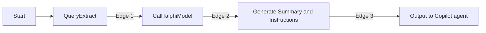

# Welcome to Taiphi Demo

## Workflow

```mermaid
graph LR
  A[Start] --> B[QueryExtract];
  B -->|Edge 1| C[CallTaiphiModel];
  C --> |Edge 2|D[Generate Summary and Instructions];
  D ---->|Edge 3| E[Output to Copilot agent];
```

## LangGraph Documentation
For full documentation visit   [LangGraph Documentation](https://langchain-ai.github.io/langgraph/tutorials/introduction/).

